# Polyglot Codebase Knowledge Graph

> Generated offline by **readmenator**. Supports C, C++, Python, Go, Rust, JS/TS, Java, C#, Shell, PHP, Dart, GDScript, Nim, ASM, Ruby, Swift, Kotlin, Scala, Lua, Elixir.
> No LLMs. No tokens. Pure static analysis. See more [here](https://github.com/grisuno/ReadMenator)

**Total Files Parsed:** 2 | **Total Symbols Extracted:** 19 | **Total Imports:** 17

<!-- ranking_model: v1.0 | weights: {ppr:0.45,auth:0.2,test:0.15,doc:0.1,fresh:0.1} | alpha:0.85 | commit:75d209c | date:2026-07-18 -->


## Table of Contents

1. [Statistics Dashboard](#statistics-dashboard)
2. [Architectural Layers](#architectural-layers)
3. [Ranked Context](#ranked-context)
4. [God Nodes](#god-nodes)
5. [Suggested Questions](#suggested-questions)
6. [Hotspot Analysis](#hotspot-analysis)
7. [Change Impact Analysis](#change-impact-analysis)
8. [Suggested Linting Rules](#suggested-linting-rules)
9. [Orphans](#orphans)
10. [Query Recipes](#query-recipes)
11. [Structural Knowledge Map](#structural-knowledge-map)
12. [UML Class Diagram](#uml-class-diagram)
13. [Code Property Graph](#code-property-graph)
14. [Architecture Reference](#architecture-reference)
    - [PY (1 files)](#py-1-files)
    - [SH (1 files)](#sh-1-files)

---

## Statistics Dashboard

| Metric | Value |
|--------|-------|
| Total Files | 2 |
| Total Symbols | 19 |
| Total Imports | 17 |
| Call Edges | 202 |
| Inheritance Edges | 3 |
| Languages | 2 |
| Avg Symbols/File | 9.5 |
| Avg Imports/File | 8.5 |

### Top Files by Import Count (Fan-Out)

| File | Imports | Symbols | Language |
|------|---------|---------|----------|
| `app.py` | 17 | 19 | py |

---

## Architectural Layers

Auto-detected from path patterns, naming conventions, and imported frameworks.

| Layer | Files |
|-------|-------|
| utility | 2 |

### utility

- `app.py` (py, 19 symbols)
- `install.sh` (sh, 0 symbols)

---

## Ranked Context

Files ranked by composite score for the current query context. The ranking combines Personalized PageRank (query relevance), global authority, test coverage, documentation coverage, and code freshness. Model: v1.0.

| Rank | File | Composite | PPR | Authority | Test | Doc |
|------|------|-----------|-----|-----------|------|-----|
| 1 | `app.py` | 0.0211 | 0.0000 | 0.0000 | 0.00 | 0.21 |
| 2 | `install.sh` | 0.0000 | 0.0000 | 0.0000 | 0.00 | 0.00 |

---

## God Nodes

Most architecturally central files ranked by combined import/export degree and symbol richness.

| File | Score | Connections | PageRank |
|------|-------|-------------|----------|
| `app.py` | 1.9 | | 0.0000 |
| `install.sh` | 0.0 | | 0.0000 |

---

## Suggested Questions

Auto-generated exploration prompts based on graph structure:

- What does app.py depend on, and what depends on it? (0 connections)
- What does install.sh depend on, and what depends on it? (0 connections)
- What is RigidSAE in app.py and how is it used?
- What is the overall architecture of this codebase?

---

## Hotspot Analysis

Files ranked by combined complexity (symbol count) and centrality (connection count). High-scoring files are architecturally critical and may need refactoring attention.

| File | Complexity | Centrality | Combined | Symbols | Connections |
|------|-----------|------------|----------|---------|-------------|
| `app.py` | 1.000 | 1.000 | 1.000 | 19 | 17 |
| `install.sh` | 0.000 | 0.000 | 0.000 | 0 | 0 |

---

## Change Impact Analysis

Files sorted by how many other files would be affected if they changed. High-impact files should be changed with caution.

| File | Direct Dependents | Transitive Dependents | Total Impact |
|------|------------------|----------------------|--------------|
| `app.py` | 0 | 0 | 0 |
| `install.sh` | 0 | 0 | 0 |

---

## Suggested Linting Rules

Automatically suggested linting and security rules based on patterns detected in the codebase. These can be exported as Semgrep rules using the `--export-rules` flag.

| Rule ID | Severity | Description | Language | Matches |
|---------|----------|-------------|----------|---------|
| `RM001` | info | Large number of functions in py: 15 total | py | 15 |
| `RM002` | info | Print statement found (consider logging instead) | python | 14 |

---

## Orphans

Files with no documentation or low connectivity. These are candidates for documentation investment or cleanup.

- `install.sh` (0 symbols, no doc)

---

## Query Recipes

Example queries you can run against this knowledge base using the ranking engine:

```
# Find files most relevant to a concept
readmenator query "Where is the import resolver implemented?"

# Rank files by relevance to a topic
readmenator query "How does documentation generation work?"

# Explain why a file ranks highly
readmenator query "explain readmenator/_documentation.py"

# Trace dependency paths with ranked context
readmenator query "path from CLI to exporter"
```

The ranking model uses the following signals:

- **Personalized PageRank** (45% weight): query-specific relevance via seed propagation
- **Global Authority** (20% weight): structural importance via standard PageRank
- **Test Coverage** (15% weight): fraction of symbols referenced in test files
- **Doc Coverage** (10% weight): presence of docstrings and file-level docs
- **Freshness** (10% weight): recent modification activity

Results include score decomposition and justification paths for each ranked item.

---

## Structural Knowledge Map

```mermaid
graph TD
    classDef mod fill:#1e1e1e,stroke:#ff6666,stroke-width:2px,color:#fff;
    classDef cls fill:#2d2d2d,stroke:#4ec9b0,stroke-width:2px,color:#fff;
    classDef fn fill:#333,stroke:#dcdcaa,stroke-width:1px,color:#dcdcaa;
    classDef ext fill:#111,stroke:#666,stroke-dasharray: 5 5,color:#aaa;
    app_py["app.py (py)"]
    class app_py mod;
    app_py_get_e8_lattice["get_e8_lattice"]
    class app_py_get_e8_lattice fn;
    app_py --> app_py_get_e8_lattice
    app_py_RigidSAE["RigidSAE"]
    class app_py_RigidSAE cls;
    app_py --> app_py_RigidSAE
    app_py_SplineComplexityManager["SplineComplexityManager"]
    class app_py_SplineComplexityManager cls;
    app_py --> app_py_SplineComplexityManager
    app_py_FastGCNLayer["FastGCNLayer"]
    class app_py_FastGCNLayer cls;
    app_py --> app_py_FastGCNLayer
    app_py_SwanEllipticGNN_v51["SwanEllipticGNN_v51"]
    class app_py_SwanEllipticGNN_v51 cls;
    app_py --> app_py_SwanEllipticGNN_v51
    install_sh["install.sh (sh)"]
    class install_sh mod;
    ext_os["os"]
    class ext_os ext;
    app_py -.->|imports| ext_os
    ext_glob["glob"]
    class ext_glob ext;
    app_py -.->|imports| ext_glob
    ext_torch["torch"]
    class ext_torch ext;
    app_py -.->|imports| ext_torch
    ext_zipfile["zipfile"]
    class ext_zipfile ext;
    app_py -.->|imports| ext_zipfile
    ext_kagglehub["kagglehub"]
    class ext_kagglehub ext;
    app_py -.->|imports| ext_kagglehub
    ext_numpy["numpy"]
    class ext_numpy ext;
    app_py -.->|imports| ext_numpy
    ext_pandas["pandas"]
    class ext_pandas ext;
    app_py -.->|imports| ext_pandas
    ext_torch_nn["torch.nn"]
    class ext_torch_nn ext;
    app_py -.->|imports| ext_torch_nn
    ext_torch_nn_functional["torch.nn.functional"]
    class ext_torch_nn_functional ext;
    app_py -.->|imports| ext_torch_nn_functional
    ext_torch_geometric_nn["torch_geometric.nn"]
    class ext_torch_geometric_nn ext;
    app_py -.->|imports| ext_torch_geometric_nn
    ext_torch_geometric_utils["torch_geometric.utils"]
    class ext_torch_geometric_utils ext;
    app_py -.->|imports| ext_torch_geometric_utils
    ext_sklearn_preprocessing["sklearn.preprocessing"]
    class ext_sklearn_preprocessing ext;
    app_py -.->|imports| ext_sklearn_preprocessing
    ext_sklearn_metrics["sklearn.metrics"]
    class ext_sklearn_metrics ext;
    app_py -.->|imports| ext_sklearn_metrics
    ext_time["time"]
    class ext_time ext;
    app_py -.->|imports| ext_time
    ext_warnings["warnings"]
    class ext_warnings ext;
    app_py -.->|imports| ext_warnings
    ext_itertools["itertools"]
    class ext_itertools ext;
    app_py -.->|imports| ext_itertools
    ext_math["math"]
    class ext_math ext;
    app_py -.->|imports| ext_math
```



---

## UML Class Diagram

Auto-generated Mermaid class diagram from parsed class-level symbols. Shows classes, structs, interfaces, traits, and their methods with inheritance and dependency relationships.

```mermaid
classDiagram
  class app_py_RigidSAE {
    <<class>>
    +get_e8_lattice()
    +load_elliptic_data()
    +train_and_evaluate_v51(X_raw, y, edge_index, train_idx, val_idx, epochs, name)
    +temporal_cross_validate(X_raw, y, edge_index, timestep)
    +__init__(self, d_model, d_sae)
    +forward(self, h)
    +compute_psi_metrics(self, z)
    +get_sparsity_loss(self, z)
    +__init__(self, threshold)
    +compute_complexity(self, pre_acts_list)
  }
  class app_py_SplineComplexityManager {
    <<class>>
    +get_e8_lattice()
    +load_elliptic_data()
    +train_and_evaluate_v51(X_raw, y, edge_index, train_idx, val_idx, epochs, name)
    +temporal_cross_validate(X_raw, y, edge_index, timestep)
    +__init__(self, d_model, d_sae)
    +forward(self, h)
    +compute_psi_metrics(self, z)
    +get_sparsity_loss(self, z)
    +__init__(self, threshold)
    +compute_complexity(self, pre_acts_list)
  }
  class app_py_FastGCNLayer {
    <<class>>
    +get_e8_lattice()
    +load_elliptic_data()
    +train_and_evaluate_v51(X_raw, y, edge_index, train_idx, val_idx, epochs, name)
    +temporal_cross_validate(X_raw, y, edge_index, timestep)
    +__init__(self, d_model, d_sae)
    +forward(self, h)
    +compute_psi_metrics(self, z)
    +get_sparsity_loss(self, z)
    +__init__(self, threshold)
    +compute_complexity(self, pre_acts_list)
  }
  class app_py_SwanEllipticGNN_v51 {
    <<class>>
    +get_e8_lattice()
    +load_elliptic_data()
    +train_and_evaluate_v51(X_raw, y, edge_index, train_idx, val_idx, epochs, name)
    +temporal_cross_validate(X_raw, y, edge_index, timestep)
    +__init__(self, d_model, d_sae)
    +forward(self, h)
    +compute_psi_metrics(self, z)
    +get_sparsity_loss(self, z)
    +__init__(self, threshold)
    +compute_complexity(self, pre_acts_list)
  }
```



---

## Code Property Graph

Machine-readable Code Property Graph (CPG) in JSON-LD format. This block allows AI agents to parse the full structural graph without additional file reads. Compatible with GraphRAG pipelines.

```json
{"@context": "https://schema.org", "analysis": {"communities": [], "god_nodes": [{"node_id": "app.py", "score": 1.9}, {"node_id": "install.sh", "score": 0.0}], "surprising_connections": []}, "edges": [{"confidence": "EXTRACTED", "relation": "imports", "source": "app.py", "target": "os"}, {"confidence": "EXTRACTED", "relation": "imports", "source": "app.py", "target": "glob"}, {"confidence": "EXTRACTED", "relation": "imports", "source": "app.py", "target": "torch"}, {"confidence": "EXTRACTED", "relation": "imports", "source": "app.py", "target": "zipfile"}, {"confidence": "EXTRACTED", "relation": "imports", "source": "app.py", "target": "kagglehub"}, {"confidence": "EXTRACTED", "relation": "imports", "source": "app.py", "target": "numpy"}, {"confidence": "EXTRACTED", "relation": "imports", "source": "app.py", "target": "pandas"}, {"confidence": "EXTRACTED", "relation": "imports", "source": "app.py", "target": "torch.nn"}, {"confidence": "EXTRACTED", "relation": "imports", "source": "app.py", "target": "torch.nn.functional"}, {"confidence": "EXTRACTED", "relation": "imports", "source": "app.py", "target": "torch_geometric.nn"}, {"confidence": "EXTRACTED", "relation": "imports", "source": "app.py", "target": "torch_geometric.utils"}, {"confidence": "EXTRACTED", "relation": "imports", "source": "app.py", "target": "sklearn.preprocessing"}, {"confidence": "EXTRACTED", "relation": "imports", "source": "app.py", "target": "sklearn.metrics"}, {"confidence": "EXTRACTED", "relation": "imports", "source": "app.py", "target": "time"}, {"confidence": "EXTRACTED", "relation": "imports", "source": "app.py", "target": "warnings"}, {"confidence": "EXTRACTED", "relation": "imports", "source": "app.py", "target": "itertools"}, {"confidence": "EXTRACTED", "relation": "imports", "source": "app.py", "target": "math"}], "generator": "readmenator", "metadata": {"edge_count": 222, "file_count": 2, "language_count": 2, "symbol_count": 19}, "nodes": [{"doc": "_*_ coding: utf8 _*_", "id": "app.py", "kind": "module", "label": "app.py", "language": "py", "sha256": "90662f168febca5e", "symbol_count": 19, "symbols": [{"kind": "function", "line": 38, "name": "get_e8_lattice", "signature": "def get_e8_lattice()"}, {"doc": "Autoencoder Disperso (SAE) ajustado al estándar teórico:\n- Pesos Atados (Tied Weights)\n- Sin sesgo en decodificador\n- Medición de Psi y F efectivas mediante Entropía de Shannon.\n- CORRECCIÓN: Incluye método get_sparsity_loss para el mecanismo Phoenix.", "kind": "class", "line": 56, "name": "RigidSAE", "signature": "class RigidSAE(Module)"}, {"doc": "Medida de Complejidad Local (LC).\nCuenta la intersección de hiperplanos (Ecuación 6) en una región local.\nAproximación: Neuronas con pre-activación cercana a 0.", "kind": "class", "line": 112, "name": "SplineComplexityManager", "signature": "class SplineComplexityManager"}, {"kind": "class", "line": 134, "name": "FastGCNLayer", "signature": "class FastGCNLayer(Module)"}, {"kind": "class", "line": 152, "name": "SwanEllipticGNN_v51", "signature": "class SwanEllipticGNN_v51(Module)"}, {"kind": "method", "line": 229, "name": "load_elliptic_data", "signature": "def load_elliptic_data()"}, {"kind": "method", "line": 260, "name": "train_and_evaluate_v51", "signature": "def train_and_evaluate_v51(X_raw, y, edge_index, train_idx, val_idx, epochs, name)"}, {"kind": "method", "line": 372, "name": "temporal_cross_validate", "signature": "def temporal_cross_validate(X_raw, y, edge_index, timestep)"}, {"kind": "method", "line": 64, "name": "__init__", "signature": "def __init__(self, d_model, d_sae)"}, {"kind": "method", "line": 73, "name": "forward", "signature": "def forward(self, h)"}, {"doc": "Implementación de las Ecuaciones (6), (7) y (8) de la teoría.\nCalcula p_i, H(p), F y Psi.", "kind": "method", "line": 80, "name": "compute_psi_metrics", "signature": "def compute_psi_metrics(self, z)"}, {"kind": "method", "line": 107, "name": "get_sparsity_loss", "signature": "def get_sparsity_loss(self, z)"}, {"kind": "method", "line": 118, "name": "__init__", "signature": "def __init__(self, threshold)"}, {"kind": "method", "line": 121, "name": "compute_complexity", "signature": "def compute_complexity(self, pre_acts_list)"}, {"kind": "method", "line": 135, "name": "__init__", "signature": "def __init__(self, in_features, out_features, edge_index, num_nodes)"}, {"kind": "method", "line": 148, "name": "forward", "signature": "def forward(self, x)"}, {"kind": "method", "line": 153, "name": "__init__", "signature": "def __init__(self, input_dim, hidden_dim, edge_index, num_nodes, dropout)"}, {"kind": "method", "line": 185, "name": "evolve_topology", "signature": "def evolve_topology(self, gap)"}, {"kind": "method", "line": 198, "name": "forward", "signature": "def forward(self, x, edge_index)"}]}, {"id": "install.sh", "kind": "module", "label": "install.sh", "language": "sh", "sha256": "c907d80fd6734993", "symbol_count": 0, "symbols": []}], "type": "CodePropertyGraph", "version": "1.0"}
```

---

## Architecture Reference

### PY (1 files)

#### `app.py`
**Path:** `app.py`
**File Doc:** *_*_ coding: utf8 _*_*

**Classes:**
- `RigidSAE` (line 56) `class RigidSAE(Module)` - *Autoencoder Disperso (SAE) ajustado al estándar teórico:
- Pesos Atados (Tied Weights)
- Sin sesgo en decodificador
- Medición de Psi y F efectivas mediante Entropía de Shannon.
- CORRECCIÓN: Incluye método get_sparsity_loss para el mecanismo Phoenix.*
- `SplineComplexityManager` (line 112) `class SplineComplexityManager` - *Medida de Complejidad Local (LC).
Cuenta la intersección de hiperplanos (Ecuación 6) en una región local.
Aproximación: Neuronas con pre-activación cercana a 0.*
- `FastGCNLayer` (line 134) `class FastGCNLayer(Module)`
- `SwanEllipticGNN_v51` (line 152) `class SwanEllipticGNN_v51(Module)`

**Functions:**
- `get_e8_lattice` (line 38) `def get_e8_lattice()`

**Methods:**
- `load_elliptic_data` (line 229) `def load_elliptic_data()`
- `train_and_evaluate_v51` (line 260) `def train_and_evaluate_v51(X_raw, y, edge_index, train_idx, val_idx, epochs, name)`
- `temporal_cross_validate` (line 372) `def temporal_cross_validate(X_raw, y, edge_index, timestep)`
- `__init__` (line 64) `def __init__(self, d_model, d_sae)`
- `forward` (line 73) `def forward(self, h)`
- `compute_psi_metrics` (line 80) `def compute_psi_metrics(self, z)` - *Implementación de las Ecuaciones (6), (7) y (8) de la teoría.
Calcula p_i, H(p), F y Psi.*
- `get_sparsity_loss` (line 107) `def get_sparsity_loss(self, z)`
- `__init__` (line 118) `def __init__(self, threshold)`
- `compute_complexity` (line 121) `def compute_complexity(self, pre_acts_list)`
- `__init__` (line 135) `def __init__(self, in_features, out_features, edge_index, num_nodes)`
- `forward` (line 148) `def forward(self, x)`
- `__init__` (line 153) `def __init__(self, input_dim, hidden_dim, edge_index, num_nodes, dropout)`
- `evolve_topology` (line 185) `def evolve_topology(self, gap)`
- `forward` (line 198) `def forward(self, x, edge_index)`

### SH (1 files)

#### `install.sh`
**Path:** `install.sh`

*No symbols extracted*
