# Polyglot Codebase Knowledge Graph

> Generated offline by **readmenator**. Supports C, C++, Python, Go, Rust, JS/TS, Java, C#, Shell, PHP, Dart, GDScript, Nim, ASM.
> No LLMs. No tokens. Pure static analysis. See more [here](https://github.com/grisuno/ReadMenator)

**Total Files Parsed:** 2 | **Total Symbols Extracted:** 19 | **Total Imports:** 17

## Structural Knowledge Map

```mermaid
graph TD
    classDef mod fill:#1e1e1e,stroke:#ff6666,stroke-width:2px,color:#fff;
    classDef cls fill:#2d2d2d,stroke:#4ec9b0,stroke-width:2px,color:#fff;
    classDef fn fill:#333,stroke:#dcdcaa,stroke-width:1px,color:#dcdcaa;
    classDef ext fill:#111,stroke:#666,stroke-dasharray: 5 5,color:#aaa;
    app_py["app.py (py)"]
    class app_py mod;
    app_py_get_e8_lattice["get_e8_lattice"]
    class app_py_get_e8_lattice fn;
    app_py --> app_py_get_e8_lattice
    app_py_RigidSAE["RigidSAE"]
    class app_py_RigidSAE cls;
    app_py --> app_py_RigidSAE
    app_py_SplineComplexityManager["SplineComplexityManager"]
    class app_py_SplineComplexityManager cls;
    app_py --> app_py_SplineComplexityManager
    app_py_FastGCNLayer["FastGCNLayer"]
    class app_py_FastGCNLayer cls;
    app_py --> app_py_FastGCNLayer
    app_py_SwanEllipticGNN_v51["SwanEllipticGNN_v51"]
    class app_py_SwanEllipticGNN_v51 cls;
    app_py --> app_py_SwanEllipticGNN_v51
    install_sh["install.sh (sh)"]
    class install_sh mod;
    ext_os["os"]
    class ext_os ext;
    app_py -.->|imports| ext_os
    ext_glob["glob"]
    class ext_glob ext;
    app_py -.->|imports| ext_glob
    ext_torch["torch"]
    class ext_torch ext;
    app_py -.->|imports| ext_torch
    ext_zipfile["zipfile"]
    class ext_zipfile ext;
    app_py -.->|imports| ext_zipfile
    ext_kagglehub["kagglehub"]
    class ext_kagglehub ext;
    app_py -.->|imports| ext_kagglehub
    ext_numpy["numpy"]
    class ext_numpy ext;
    app_py -.->|imports| ext_numpy
    ext_pandas["pandas"]
    class ext_pandas ext;
    app_py -.->|imports| ext_pandas
    ext_torch_nn["torch.nn"]
    class ext_torch_nn ext;
    app_py -.->|imports| ext_torch_nn
    ext_torch_nn_functional["torch.nn.functional"]
    class ext_torch_nn_functional ext;
    app_py -.->|imports| ext_torch_nn_functional
    ext_torch_geometric_nn["torch_geometric.nn"]
    class ext_torch_geometric_nn ext;
    app_py -.->|imports| ext_torch_geometric_nn
    ext_torch_geometric_utils["torch_geometric.utils"]
    class ext_torch_geometric_utils ext;
    app_py -.->|imports| ext_torch_geometric_utils
    ext_sklearn_preprocessing["sklearn.preprocessing"]
    class ext_sklearn_preprocessing ext;
    app_py -.->|imports| ext_sklearn_preprocessing
    ext_sklearn_metrics["sklearn.metrics"]
    class ext_sklearn_metrics ext;
    app_py -.->|imports| ext_sklearn_metrics
    ext_time["time"]
    class ext_time ext;
    app_py -.->|imports| ext_time
    ext_warnings["warnings"]
    class ext_warnings ext;
    app_py -.->|imports| ext_warnings
    ext_itertools["itertools"]
    class ext_itertools ext;
    app_py -.->|imports| ext_itertools
    ext_math["math"]
    class ext_math ext;
    app_py -.->|imports| ext_math
```

---

## Architecture Reference

### PY (1 files)

#### `app.py`
**Path:** `app.py`

**Classes:**
- `RigidSAE` (line 56) `class RigidSAE` - *Autoencoder Disperso (SAE) ajustado al estándar teórico:
- Pesos Atados (Tied Weights)
- Sin sesgo en decodificador
- Medición de Psi y F efectivas mediante Entropía de Shannon.
- CORRECCIÓN: Incluye método get_sparsity_loss para el mecanismo Phoenix.*
- `SplineComplexityManager` (line 112) `class SplineComplexityManager` - *Medida de Complejidad Local (LC).
Cuenta la intersección de hiperplanos (Ecuación 6) en una región local.
Aproximación: Neuronas con pre-activación cercana a 0.*
- `FastGCNLayer` (line 134) `class FastGCNLayer`
- `SwanEllipticGNN_v51` (line 152) `class SwanEllipticGNN_v51`

**Functions:**
- `get_e8_lattice` (line 38) `def get_e8_lattice()`
- `load_elliptic_data` (line 229) `def load_elliptic_data()`
- `train_and_evaluate_v51` (line 260) `def train_and_evaluate_v51(X_raw, y, edge_index, train_idx, val_idx, epochs, name)`
- `temporal_cross_validate` (line 372) `def temporal_cross_validate(X_raw, y, edge_index, timestep)`
- `__init__` (line 64) `def __init__(self, d_model, d_sae)`
- `forward` (line 73) `def forward(self, h)`
- `compute_psi_metrics` (line 80) `def compute_psi_metrics(self, z)` - *Implementación de las Ecuaciones (6), (7) y (8) de la teoría.
Calcula p_i, H(p), F y Psi.*
- `get_sparsity_loss` (line 107) `def get_sparsity_loss(self, z)`
- `__init__` (line 118) `def __init__(self, threshold)`
- `compute_complexity` (line 121) `def compute_complexity(self, pre_acts_list)`
- `__init__` (line 135) `def __init__(self, in_features, out_features, edge_index, num_nodes)`
- `forward` (line 148) `def forward(self, x)`
- `__init__` (line 153) `def __init__(self, input_dim, hidden_dim, edge_index, num_nodes, dropout)`
- `evolve_topology` (line 185) `def evolve_topology(self, gap)`
- `forward` (line 198) `def forward(self, x, edge_index)`

### SH (1 files)

#### `install.sh`
**Path:** `install.sh`

*No symbols extracted*
